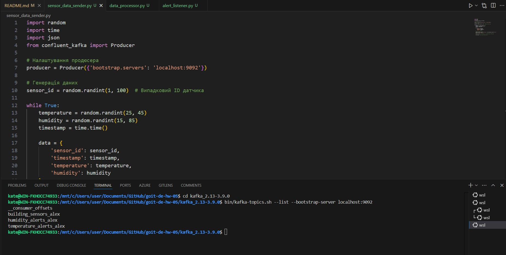
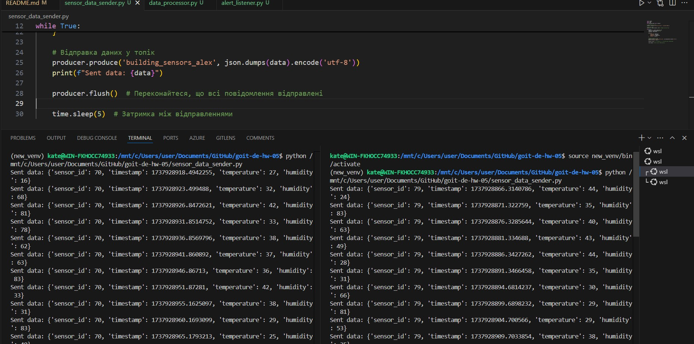
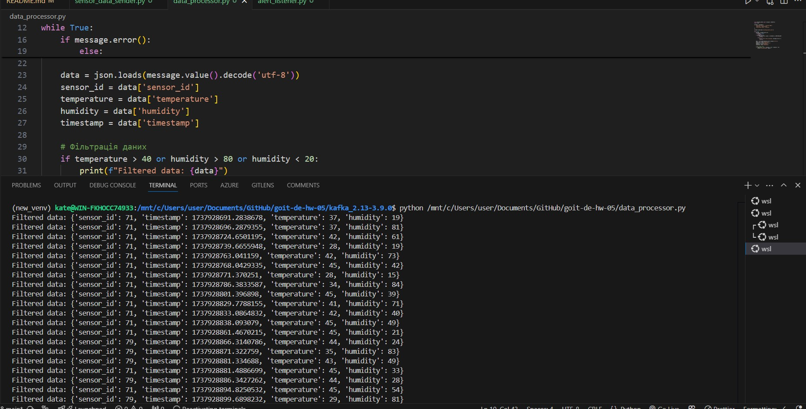
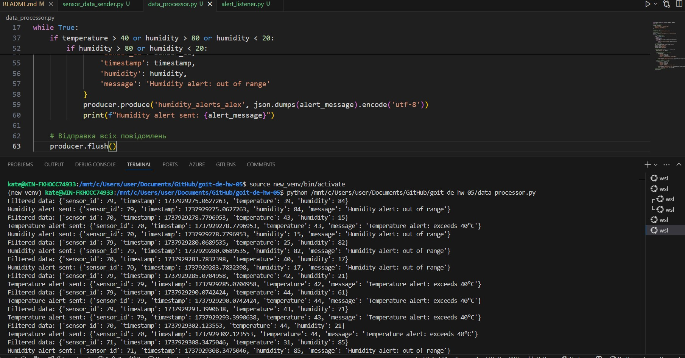
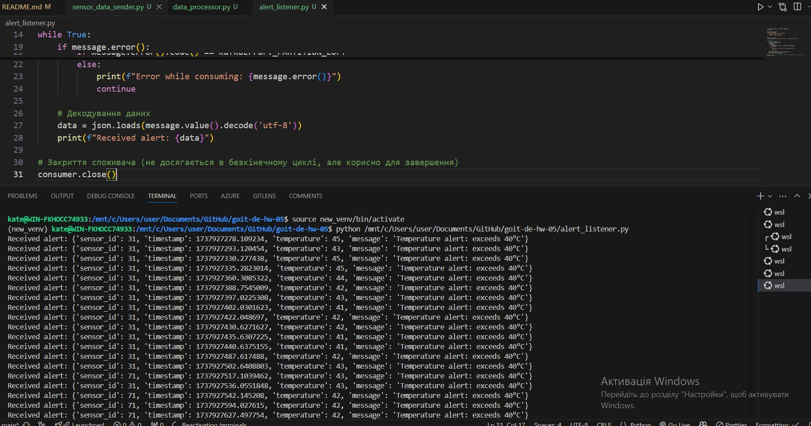

# goit-de-hw-05

Ось короткий опис кожного з етапів виконання завдання:

1 Створення топіків в Kafka
На цьому етапі ми створили три топіки в Kafka, які будуть використовуватися для зберігання даних та сповіщень. Імена топіків повинні містити ваші імена або інші ідентифікатори, щоб уникнути дублювання.

Топік building_sensors: Використовується для зберігання даних з усіх датчиків.
Топік temperature_alerts: Використовується для зберігання сповіщень про перевищення допустимого рівня температури.
Топік humidity_alerts: Використовується для зберігання сповіщень про вихід рівня вологості за допустимі рамки.

2 Відправка даних до топіків
На цьому етапі ми написали Python-скрипт, який імітує роботу датчика. Скрипт періодично відправляє випадково згенеровані дані (температуру та вологість) у топік building_sensors.

Дані: Скрипт генерує дані, які містять:
Ідентифікатор датчика (постійний для одного запуску, але може змінюватися при повторному запуску).
Час отримання даних.
Випадкові показники температури (від 25 до 45 градусів) та вологості (від 15 до 85%).
Запуск скрипту: Для імітації декількох датчиків, скрипт потрібно запускати кілька разів.

3 Обробка даних
На цьому етапі ми написали Python-скрипт, який підписується на топік building_sensors і обробляє отримані дані.

Перевірка даних:
Якщо температура перевищує 40°C, генерується сповіщення, яке відправляється в топік temperature_alerts.
Якщо вологість перевищує 80% або менше 20%, генерується сповіщення, яке відправляється в топік humidity_alerts.
Сповіщення: Сповіщення повинні містити:
Ідентифікатор датчика.
Значення показників (температура та вологість).
Час отримання даних.
Повідомлення про перевищення порогового значення.

4 Остаточні дані
На цьому етапі ми написали Python-скрипт, який підписується на топіки temperature_alerts та humidity_alerts і зчитує сповіщення.

Виведення на екран: Скрипт виводить на екран отримані сповіщення, що дозволяє вам бачити, коли відбуваються перевищення температури або вологості.
Підсумок
Ці етапи описують процес створення системи для моніторингу даних з датчиків, обробки цих даних та генерації сповіщень у разі перевищення порогових значень.

Кроки для запуску

Все відкриваємо в терміналі WSL

## Завантажте Kafka: Якщо ви ще не завантажили Kafka, ви можете зробити це за допомогою команди wget або просто завантажити його з офіційного сайту Apache Kafka

wget https://downloads.apache.org/kafka/3.9.0/kafka_2.13-3.9.0.tgz

- Розпакуйте Kafka

tar -xzf kafka_2.13-3.9.0.tgz

- Перейдіть до каталогу Kafka

cd kafka_2.13-3.9.0

## 1 У першому терміналі запустіть Zookeeper

cd kafka_2.13-3.9.0
bin/zookeeper-server-start.sh config/zookeeper.properties

## 2 У другому терміналі запустіть Kafka сервер

cd kafka_2.13-3.9.0
bin/kafka-server-start.sh config/server.properties

## 3 Створіть топіки

cd kafka_2.13-3.9.0

- Створення топіка building_sensors

  bin/kafka-topics.sh --create --topic building_sensors_alex --bootstrap-server localhost:9092 --partitions 1 --replication-factor 1

- Створення топіка temperature_alerts

  bin/kafka-topics.sh --create --topic temperature_alerts_alex --bootstrap-server localhost:9092 --partitions 1 --replication-factor 1

- Створення топіка humidity_alerts

  bin/kafka-topics.sh --create --topic humidity_alerts_alex --bootstrap-server localhost:9092 --partitions 1 --replication-factor 1

  bin/kafka-topics.sh --list --bootstrap-server localhost:9092

## Встановлення python3

cd kafka_2.13-3.9.0

sudo apt install python3

## Встановлення віртуальні середовища

sudo apt install python3-venv

source venv/bin/activate

pip install -r requirements.txt

або

pip install confluent-kafka

python -c "import confluent_kafka; print(confluent_kafka.**version**)"

## 4 Запустіть продюсера

- Відкрийте новий термінал WSL і запустіть :

python /mnt/c/Users/user/Documents/GitHub/goit-de-hw-05/sensor_data_sender.py

## 5 Запустіть споживача для сповіщень

- Відкрийте ще один термінал і запустіть:

python /mnt/c/Users/user/Documents/GitHub/goit-de-hw-05/data_processor.py

## 6 Запустіть споживача для даних з датчиків

-Відкрийте ще один термінал і запустіть:

python /mnt/c/Users/user/Documents/GitHub/goit-de-hw-05/alert_listener.py

### Ось отримані результати

- скрин трьох топіків з команди [print(topic) for topic in admin_client.list_topics() if "my_name" in topic]
  

- скрин генерації даних сенсорів та відправки даних в building_sensors з демонстрацією двох (або більше) одночасних роботи двох запусків програми
  

- скрин отримання даних та фільтрації саме тих даних, що будуть далі використані
  

- скрин з демонстрацією того, що відфільтровані дані були послані у відповідні топіки
  

- скрин з результатом запису відфільтрованих даних
  
